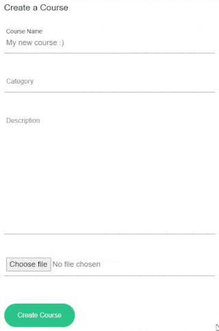

# Classable

***it may take a minute for the server to start up after making a request***
### [Live Application](https://classable.netlify.app)
### [API Spec](https://github.com/hubertlemczak/classable-api)
### [Entity Relationship Diagram](./plan/classable-erd.png)

## Table of contents

- [Introduction](#introduction)
  - [Tools used](#tools-used)
- [Express error handling middleware](#express-error-handling-middleware)
- [Authentication](#authentication)
- [Course creation](#course-creation)
  - [Roles and authorisation](#roles-and-authorisation)
- [Sidebar](#sidebar)
- [~~Dashboard~~ (coming soon)](#dashboard)
- [~~Assignments~~ (coming soon)](#assignments)
- [Resources](#resources)
  - [Boards with drag and drop library](#boards-with-drag-and-drop-library)
  - [Notes with markdown parsing](#notes-with-markdown-parsing)
- [Messages](#messages)
  - [Real time chat messaging with socket.io](#real-time-chat-messaging-with-socket.io)
  - [Ticket support system](#ticket-support-system)
- [Live video calls](#live-video-calls)
  - [Classrooms](#classrooms)
  - [Using AgoraSDK](#using-agorasdk)
- [~~Calendar~~ (coming soon)](#calendar)

## Introduction

A feature rich full-stack application designed for online education. Aims to provide an efficient digital community for students and academic staff. Featuring a highly interactive UI, live notifications, chats, resource storage and video call functionality. Let the learning begin with Classable.

### Tools used

- React
- TailwindCSS
- Styled-Components
- TypeScript
- Express
- Prisma
- PostgreSQL
- Supabase
- [Agora.io](https://docs.agora.io/en/video-calling/get-started/get-started-sdk)
- [Socket.io](https://socket.io/)
- jsonwebtoken
- [@hello-pangea/dnd](https://github.com/hello-pangea/dnd) 
- Jest
- bcrypt
- [ts-node-dev](https://www.npmjs.com/package/ts-node-dev)

## Express error handling middleware

Using [express-async-errors](https://www.npmjs.com/package/express-async-errors) we can create a 'catch-all' middleware for errors.

```ts
// First we require the package
require('express-async-errors');

// We can now use our error handling middleware
app.use(errorHandler);
```

```ts
// Custom error class to throw known errors
export class HttpException extends Error {
  status: number;
  constructor(status: number, message: string) {
    super(message);
    this.status = status;
  }
}
// example use case
if (!isValid) {
  throw new HttpException(403, 'Invalid credentials');
}
```

```ts
// We can use the ErrorRequestHandler type from express
const errorHandler: ErrorRequestHandler = (err, req, res, next) => {
  // Checking the instance of the error and error codes allows us to respond with valuable error messages
  if (err instanceof HttpException) {
    return res.status(err.status).json({ error: err.message });
  }

  if (err instanceof PrismaClientKnownRequestError) {
    if (err.code === 'P2002') {
      return res
        .status(400)
        .json({ error: `${err?.meta?.target} already in use` });
    }
  }
};
```

## Authentication

API endpoints can be protected behind an authentication middleware layer like so:

```ts
api.get('/users/:id', authenticateUser, usersController.getById);
```

The request will contain an authorization header containing a valid `Bearer token`, or an exception will be thrown and caught by the error middleware.

```ts
// client
get: async path => {
  const token = localStorage.getItem('classable-token');
  const headers = {
    Authorization: `Bearer ${token}`,
  };

  return axios.get(`${host}${path}`, { headers });
},

//server
const token = req.headers.authorization?.trim().split(' ')[1];
```

From the decoded token, we can find the user in our database and attach the following data to the request object:

```ts
req.user = {
  id: user.id,
  email: user.email,
  firstName: user.profile?.firstName,
  lastName: user.profile?.lastName,
};
```

We call the `next()` function and are now able to access the user who is making the request further down the line in our controller functions.

## Course creation

Users are able to create their own course and they will automatically be assigned the `COURSEADMIN` role on creation. A user can have a different role for each course: `STUDENT`, `TEACHER` and `COURSEADMIN`.

A highly customisable and reusable form input component is used throughout the application. If a label prop is provided we can see floating label transitions for an intuative UI.




### Roles and authorisation

We can also invite users to out course with the search by email feature. When we type into the search field there will not be any any API calls, however if we wait 500ms without any input an API call will be made to search for users containing the inputted email.

```ts
let timeOut;

function handleChange(e) {
  ...
  clearTimeout(timeOut);

  timeOut = setTimeout(() => {
    setGetUsers(true);
  }, 500);
  ...
}
```

The user is able to invite found users to the course and select a role for them, or remove them from the invite list.


After the course is created we are taken back to the `/courses` route, which renders a list of courses the user is enroled in. The course name must be unique but an image does not need to be provided as it will display the default `Classable logo`.

Let's view our new course!


## Sidebar


Viewing our course takes us to the `/courses/:courseName/dashboard` route with the course name formatted for a more appealing look. Our example course `Classable Development` will look like this: `classable-development`

```ts
  const coursePath = name.toLowerCase().replaceAll(' ', '-');
```

This sidebar is present for every route in the course view and the `Outlet` component from `react-router-dom` is wrapped in a styled-component, making the site have a fixed height look.

```ts
export const OutletContainer = styled.div`
  overflow-y: scroll;
  margin: 100px 0px 0px 0px;
  padding: 20px;
  max-height: calc(100vh - 100px);
  width: 100%;
`;
```

## ~~Dashboard~~


## ~~Assignments~~

## Resources

My goal with the resources section was to provide a collaborative way to create notes and boards such as Kanban.

### Boards with drag and drop library

### Notes with markdown parsing

## Messages

### Real time chat messaging with socket.io

### Ticket support system

## Live video calls

### Classrooms

### Using AgoraSDK

## ~~Calendar~~