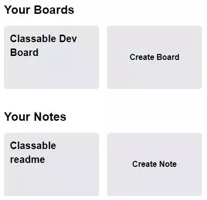

# Classable

***note it may take a minute for the server to start up after making a request***
### [Live Application](https://classable.netlify.app)
### [Page Wireframes](https://raw.githubusercontent.com/hubertlemczak/classable/main/plan/wireframe-plan.svg)
### [API Spec](https://github.com/hubertlemczak/classable-api)
### [Entity Relationship Diagram](./plan/classable-erd.png)

## Table of contents

- [Introduction](#introduction)
  - [Tools used](#tools-used)
- [Express error handling middleware](#express-error-handling-middleware)
- [Authentication](#authentication)
- [Course creation](#course-creation)
  - [Roles and authorisation](#roles-and-authorisation)
- [Navigation](#navigation)
  - [Top navigation bar](#top-navigation-bar)
  - [Sidebar](#sidebar)
- [Live video calls](#live-video-calls)
- [~~Dashboard~~ (coming soon)](#dashboard)
- [~~Assignments~~ (coming soon)](#assignments)
- [Resources](#resources)
  - [Boards with drag and drop library](#boards-with-drag-and-drop-library)
  - [Persisting board state](#persisting-board-state)
  - [Notes with markdown parsing](#notes-with-markdown-parsing)
- [Messages](#messages)
  - [Real time chat messaging with socket.io](#real-time-chat-messaging-with-socketio)
  - [Ticket support system](#ticket-support-system)
- [~~Calendar~~ (coming soon)](#calendar)

## Introduction

A feature rich full-stack application designed for online education. Aims to provide an efficient digital community for students and academic staff. Featuring a highly interactive UI, live notifications, chats, resource storage and video call functionality. 

Let the learning begin with Classable!


### Tools used

- React
- TailwindCSS
- Styled-Components
- TypeScript
- Express
- Prisma
- PostgreSQL
- Supabase
- [Agora.io](https://docs.agora.io/en/video-calling/get-started/get-started-sdk)
- [Socket.io](https://socket.io/)
- jsonwebtoken
- [@hello-pangea/dnd](https://github.com/hello-pangea/dnd) 
- Jest
- bcrypt
- [ts-node-dev](https://www.npmjs.com/package/ts-node-dev)

## Express error handling middleware

Using [express-async-errors](https://www.npmjs.com/package/express-async-errors) we can create a 'catch-all' middleware for errors.

```ts
// First we require the package
require('express-async-errors');

// We can now use our error handling middleware
app.use(errorHandler);
```

```ts
// Custom error class to throw known errors
export class HttpException extends Error {
  status: number;
  constructor(status: number, message: string) {
    super(message);
    this.status = status;
  }
}
// example use case
if (!isValid) {
  throw new HttpException(403, 'Invalid credentials');
}
```

```ts
// We can use the ErrorRequestHandler type from express
const errorHandler: ErrorRequestHandler = (err, req, res, next) => {
  // Checking the instance of the error and error codes allows us to respond with valuable error messages
  if (err instanceof HttpException) {
    return res.status(err.status).json({ error: err.message });
  }

  if (err instanceof PrismaClientKnownRequestError) {
    if (err.code === 'P2002') {
      return res
        .status(400)
        .json({ error: `${err?.meta?.target} already in use` });
    }
  }
};
```

## Authentication

API endpoints can be protected behind an authentication middleware layer like so:

```ts
api.get('/users/:id', authenticateUser, usersController.getById);
```

But before a user can be authenticated, they will need to create or log into an existing account to receive a `Bearer token` from the server (a public demo account is provided for testing purposes with the `use demo` link).


```ts
// auth endpoints
api.post('/login', authController.login);
api.post('/register', authController.register);
```

When the user is logged in, sequential requests will contain an authorization header containing a valid `Bearer token`, or an exception will be thrown and caught by the error handling middleware.

```ts
// client
get: async path => {
  const token = localStorage.getItem('classable-token');
  const headers = {
    Authorization: `Bearer ${token}`,
  };

  return axios.get(`${host}${path}`, { headers });
},

// server
const token = req.headers.authorization?.trim().split(' ')[1];
```

From the decoded token, we can find the user in our database and attach the following data to the request object:

```ts
req.user = {
  id: user.id,
  email: user.email,
  firstName: user.profile?.firstName,
  lastName: user.profile?.lastName,
};
```

We call the `next()` function and are now able to access the user who is making the request further down the line in our controller functions.

## Course creation

Users are able to create their own course and they will automatically be assigned the `COURSEADMIN` role on creation. A user can have a different role for each course: `STUDENT`, `TEACHER` and `COURSEADMIN`.

A highly customisable and reusable form input component is used throughout the application. If a label prop is provided we can see floating label transitions for an intuative UI.


### Roles and authorisation

We can also invite users to our course with the search by email feature. When we type into the search field there will not be any API calls, however if we wait 500ms without any input an API call will be made to search for users containing the inputted email.

```ts
let timeOut;

function handleChange(e) {
  ...
  clearTimeout(timeOut);

  timeOut = setTimeout(() => {
    setGetUsers(true);
  }, 500);
  ...
}
```

The user is able to invite found users to the course and select a role for them (from the roles listed above), or remove them from the invite list.


After the course is created, we are taken back to the `/courses` route, which renders a list of courses the user is enroled in. The course name must be unique but an image does not need to be provided as it will display the default `Classable logo`.

Let's view our new course!


## Navigation

Viewing our course takes us to the `/courses/:courseName/dashboard` route with the course name formatted for a more appealing look. Our example course `Classable Development` will look like this: `classable-development`

```ts
  const coursePath = name.toLowerCase().replaceAll(' ', '-');
```

### Top navigation bar


An example notification is shown and the notification count displayed in the green circle next to the bell icon. Clicking on the users profile icon also reveals additional settings the user can interact with.

The features are fully responsive on mobile devices.

### Sidebar


Each route has a custom active SVG. The line svg is replaced with the solid active state svg and filled with the primary green colour as seen throughout the app. This sidebar is present for every route in the course view and the `Outlet` component from `react-router-dom` is wrapped in a styled-component, making the site have a fixed height look.

```ts
export const OutletContainer = styled.div`
  overflow-y: scroll;
  margin-top: 100px;
  padding: 20px;
  max-height: calc(100vh - 100px);
  width: 100%;
`;
```

## Live video calls

The implementation of this feature was easily the most exciting out of the rest, and the one I also spent the most time on. It was an enjoyable learning experience reading through available resources on peer-to-peer protocols and `WebRTC`, however, for this feature I decided to use `Agora's SDK` because of their great documentation and to serve as an introduction into video communication between multiple clients.

Let's view the `Classroom` tab to explore how I created this interactive feature with audio, video and screen share capabilities, by implementing [AgoraSDK](https://docs.agora.io/en/video-calling/get-started/get-started-sdk) and public and private rooms.


Viewing the page, we are greeted with a list of all created rooms in the current course. As shown in the picture below, one of the rooms we attempted to join is password protected. Here the password is the classic `123`, but we can always create a new room by clicking the `Create Classroom` button.


For our `Create Classroom form`, as seen above, we will need to fill in the required `Room Name` field to successfully create the room. You can also supply an optional password to create a private call. After creating the room, the user will need a `token` to join it. 

Let's see how this works on the server!

```ts
// Client requests to join and provides password if needed
const res = await client.post(`/classrooms/${id}`, {
  password: passwordInput,
});

// Server
async function createToken(req: TRequestWithUser, res: Response) {
  const { password } = req.body;
  const { id } = req.params;

  const course = await dbClient.classroom.findFirstOrThrow({
    where: { id },
  });

  /* If our found classroom requires a password, we will begin to compare 
  the user input using our "compareStringToHash" helper function */
  if (course.password) {
    const isValid = await compareStringToHash(password, course.password);

    // Using our custom error class to throw useful messages
    if (!isValid) {
      throw new HttpException(403, 'Invalid password');
    }
  }

  /* Since the request was handled by the authentication middleware, we 
  can be sure that the user data exists on the request object */
  const userId = req.user?.id as string;

  // We can now create our token (see below function)...
  const token = getRtcToken(course.name, userId);

  // ...and respond to the client
  res.status(201).json({ token });
}
```

Useful link: [agora-access-token](https://www.npmjs.com/package/agora-access-token) package.

```ts
function getRtcToken(name: string, uid: string) {
  // These secrets can be found in your Agora.io project console
  const APP_ID = process.env.AGORA_APP_ID;
  const APP_CERTIFICATE = process.env.AGORA_APP_CERTIFICATE;

  if (!APP_ID || !APP_CERTIFICATE) {
    throw new HttpException(500, 'Live video application error');
  }

  // Current time in seconds (ECMAScript epoch)
  const currentTime = Math.floor(Date.now() / 1000);
  // One hour expiry time for the token
  const expiryTime = currentTime + 3600;

  /* Using the agora-access-token npm package to create the token,
  which will only work for our room */
  return RtcTokenBuilder.buildTokenWithUid(
    APP_ID,
    APP_CERTIFICATE,
    name,
    uid,
    1,
    expiryTime
  );
}
```

We now have our `Agora token` on our client, the next steps are to navigate to the correct route, initiate the `Agora engine`, join the channel and publish the users video and audio tracks.

```js
navigate(`./${id}`, { state: { channel: name, token } });

...
await agoraClient.join(appId, channel, token, user.id);
// Audio and video tracks from "AgoraRTC.createMicrophoneAndCameraTracks"
agoraClient.publish(tracks);
...
```

While the client is connecting, a reusable spinner component can be seen to represent the loading state.


If everything was successful, our call interface will load, as seen above, with the main video area and a media controls bar centred on the bottom of the page. These are the four control interactions:
  
- Muting and unmuting your microphone. Muting the microphone will emit a `user-unpublished` event with the `audio` media type, which we can simply stop playing `usr.audioTrack?.stop();`. Unmuting will emit the opposite `user-published` event and play the audio track `usr.audioTrack?.play();`
- Enabling and disabling the camera. Toggling this control will emit the same events as previously described. However, when the user disabled their camera, they will be removed from the `users state` and will not be shown in the video grid. I'm working on displaying a black screen with the user's name instead of deleting them from state.


- Start and stop screen share. Clicking the button will show a pop-up screen share prompt asking the user to select which contents they want to share in the call. When the user clicks the share button, we will `unpublish` their camera track in order to `publish` their screen track. Users in the call can click on the shared screen or other users in the grid to view in `big-picture mode`.
- Leave call. Simply terminates and unpublishes the users tracks and then navigates the user back to the classroom route. 


From the screen sharing example above, the user has chosen to share a specific window and other users can now view the stream in `big-picture mode` by clicking on it.

## ~~Dashboard~~

## ~~Assignments~~

## Resources

My goal with the resources section was to provide a collaborative way to create notes and boards such as Kanban. Users can create resources that are accessible in a unique course. I'm implementing a status feature allowing users to toggle their resources from `PUBLIC` to `PRIVATE`, which would remove it from the community section and would only be visible to the author.




Starred resources, both community and the users, will appear under the starred section above the users boards. Clicking the `Create` button will take the user to an empty page with the newly created resource, where they can perform various `CRUD` operations for customisation.

### Boards with drag and drop library

Let's view `Classable Dev Board` to explore how I created this interactive Kanban board by implementing the [@hello-pangea/dnd](https://github.com/hello-pangea/dnd) drag and drop library and used a `PostgreSQL` database to persist the state of the board.


Clicking onto the title will reaveal an editable input field which will send a `PATCH` request to our `REST API`. The updated text can be submitted by simply clicking away from the input field, or as seen in one of the tasks in the `Todo's` column, a keyboard accessibility feature will be implemented to allow a submit event to fire on key press such as `enter`.


When we click on the `Add new row` or `Add new column` button, the button will be replaced with an input field and if there is a valid input value, a new column or row will be created.

Viewing the row will open a modal pop-up where we can edit the row title and content, or delete the row by pressing the three dot menu. The content field fully supports markdown and will be further covered in the notes resource section. 

The drag and drop library has the following three main components:

```js
{/* The DragDropContext which we will pass a "onDragEnd" function to 
handle our state changes after a "Draggable" component within is dropped */} 
<DragDropContext onDragEnd={onDragEnd}>

  {/* The Droppable component which will require a unique id and we can 
  specify options such as the direction or type of the droppable */} 
  <Droppable droppableId={board.id} direction="horizontal" type="column">

    {/* The Draggable component, which must be dropped in a "Droppable", will 
    again require a unique id and an index to manage the order of our components */} 
    <Draggable draggableId={id} index={index}>

    </Draggable>

  </Droppable>

</DragDropContext>
```

To get a better understanding of how each of these components are used, we can take a look at our wireframe below. 

- The yellow represents the droppable area of our columns and anything dropped outside of this area will cancel the action. 
- The red area represents our row droppable and this also allows us to drop rows into different columns. 
- The green area represents the column draggable. However, the user is only able to drag the column by the top header section, also known as the `draggable handle`, which can be specified by the `provided.dragHandleProps` prop from the dnd library. 
- Finally, the purple represents the row draggable area, which can be dropped in its own or different column.


### Persisting board state

Using `Prisma`, we can define our model relations between the `Board`, `BoardColumn` and `BoardColumnRow` in our relational `PostgreSQL` database.

```js
model Board {
  columns BoardColumn[]

  ...
}

model BoardColumn {
  position  Int
  boardId   String
  rows      BoardColumnRow[]

  board     Board @relation(fields: [boardId], references: [id], onDelete: Cascade)

  ...
}

model BoardColumnRow {
  position      Int
  boardColumnId String

  column        BoardColumn @relation(fields: [boardColumnId], references: [id], onDelete: Cascade)

  ...
}
```

The `Board` model has a `one-to-many` relation with `BoardColumn`, meaning our board can have many columns. The same thing applies to the  `BoardColumn` and `BoardColumnRow` models, as a column can have many rows. 

To persist the state of the board, the column and row entries have a position field (type integer), which can be sorted in ascending order and sent to the client. When the user performs a drag event, we first check if the target is in the same position (if it is we will early return). If the target changed positions, a `PATCH` request is made and we loop over the target resource to update the position fields in the database. Finally, we update the local state to represent the changes.

After refreshing the page, all of the new changes will persist.


### Notes with markdown parsing

Let's view `Classable readme` to explore how I created this interactive note editor by implementing the [react-markdown](https://github.com/remarkjs/react-markdown) package.


The same editable title component is used for this notes and board section as seen above. To save a valid input value, simply click outside of the input field and this will send a `PATCH` request to our `REST API`. Currently, a keyboard accessibility feature is being worked on to update the title with a keydown event such as `enter`.

To edit the content, we can click the edit icon which will show us the text editor below. Here we can input any valid markdown and `save` or `cancel` the changes we made. The note content supports valid markdown as seen in the example above such as code blocks, different size headings, emphasised text, nested bulleted lists and images.


```css
/* Using styled-components we can declare specific styling of the parsed markdown such as our list and sub-list elements */
li {
  list-style-type: disc;
  margin-left: 30px;
  padding-left: 10px;
}

li > ul > li {
  list-style-type: circle;
}
```

```js
// We can now wrap the ReactMarkdown component with our styled component
<StyledMdContainer>
  <ReactMarkdown>{note.content}</ReactMarkdown>
</StyledMdContainer>
```


## Messages

### Real time chat messaging with socket.io

### Ticket support system

## ~~Calendar~~
